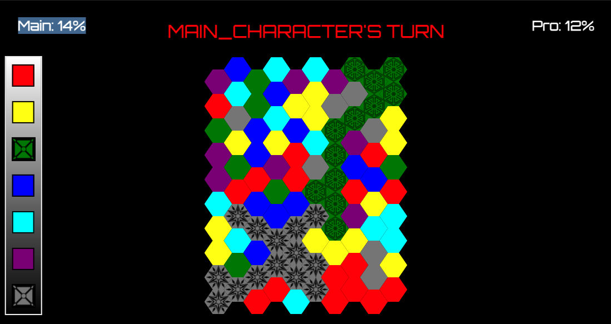
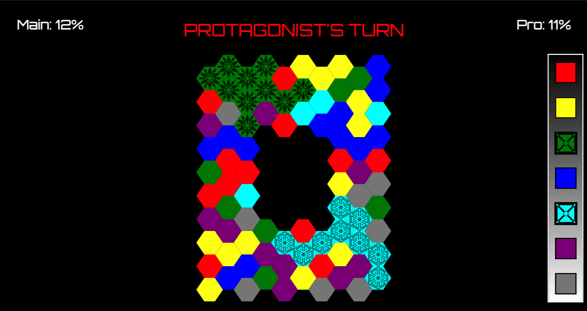

# Game

Hexcalour is a game of based on colors. This game is a two player game where each player competes to take over half the board. The first player who succeeds wons on that board.
 
# Rules
- Change your color
- Take over the same color hexes next to you
- Repeat until you take over half the board

# Technologies used
- HTML
- CSS: modals
- JavaScript: loops, math methods/randomization, array methods, event listeners, callback

# Code Style

 I didn't use anything too crazy. Mostly just used basic javascript. 

# Screen Shots
    
    

